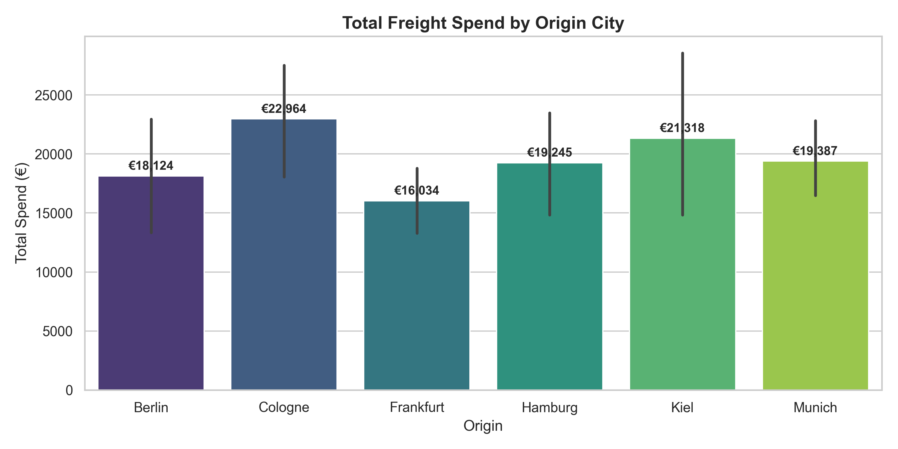

# Logistics Route Optimization & Freight Cost Modeling Engine

## Overview
This project models multi-lane freight transportation efficiency across regional origin-destination corridors. It uses geodesic coordinate math (Haversine distance), freight cost structures, and payload consolidation metrics to identify Less-Than-Truckload (LTL) vs. Full-Truckload (FTL) savings.

---

## Core Transport Equations

### 1. Haversine Distance Geometry
Calculates shortest great-circle distance over Earth's surface from GPS coordinates:
$$d = 2r \arcsin \left( \sqrt{\sin^2\left(\frac{\Delta \phi}{2}\right) + \cos(\phi_1)\cos(\phi_2)\sin^2\left(\frac{\Delta \lambda}{2}\right)} \right)$$

### 2. Freight Cost Breakdown
$$\text{Total Cost} = \left( \text{Base Rate} + (\text{Distance} \times \text{Rate/km}) + (\text{Weight} \times \text{Rate/kg}) \right) \times (1 + \text{Fuel Surcharge \%})$$

### 3. Ton-KM Efficiency Index
$$\text{Cost per Ton-KM} = \frac{\text{Total Freight Cost}}{\left(\frac{\text{Weight (kg)}}{1000}\right) \times \text{Distance (km)}}$$

---

## Lane Cost Visual Report



---

## Repository Structure

```text
route_optimization_project/
│
├── README.md                     <-- Project documentation
├── requirements.txt              <-- Python dependencies
├── .gitignore                    <-- Git exclusion rules
│
├── data/
│   ├── raw/
│   │   └── shipments.csv         <-- Input dataset
│   └── processed/
│       ├── optimized_shipments.csv
│       └── lane_consolidation_summary.xlsx
│
├── src/
│   └── optimize_routes.py        <-- Distance & cost calculation engine
│
└── reports/
    └── freight_spend_chart.png   <-- Lane spend breakdown